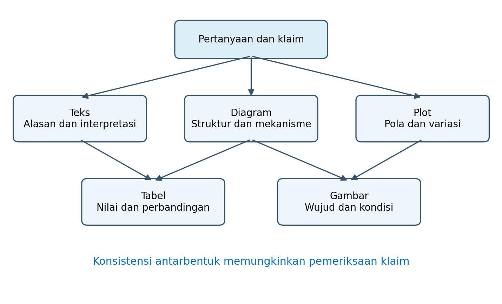
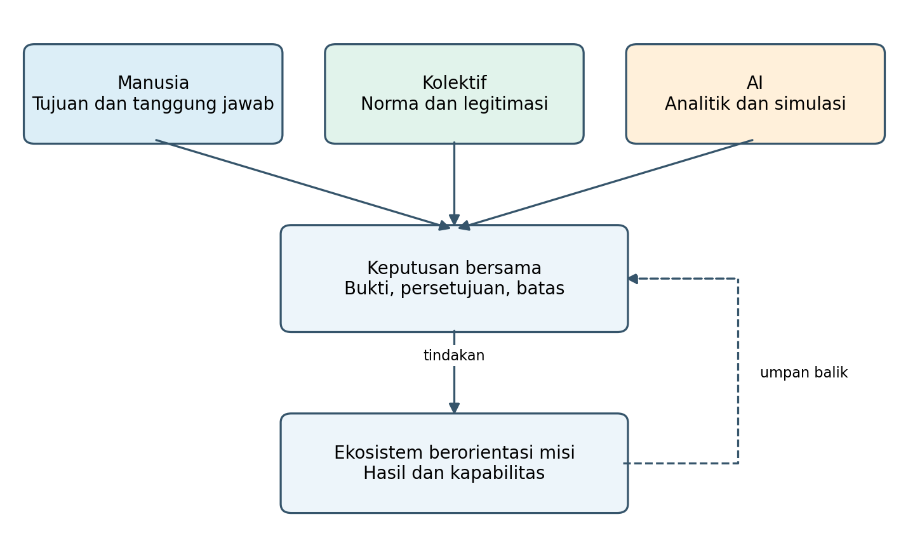
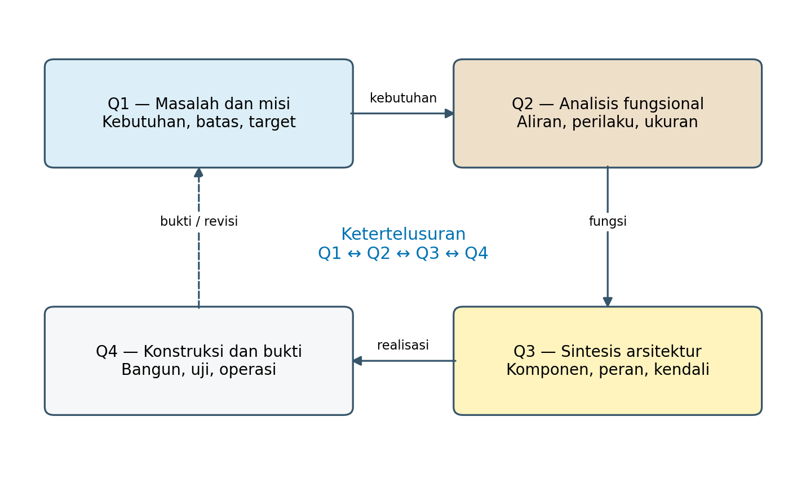
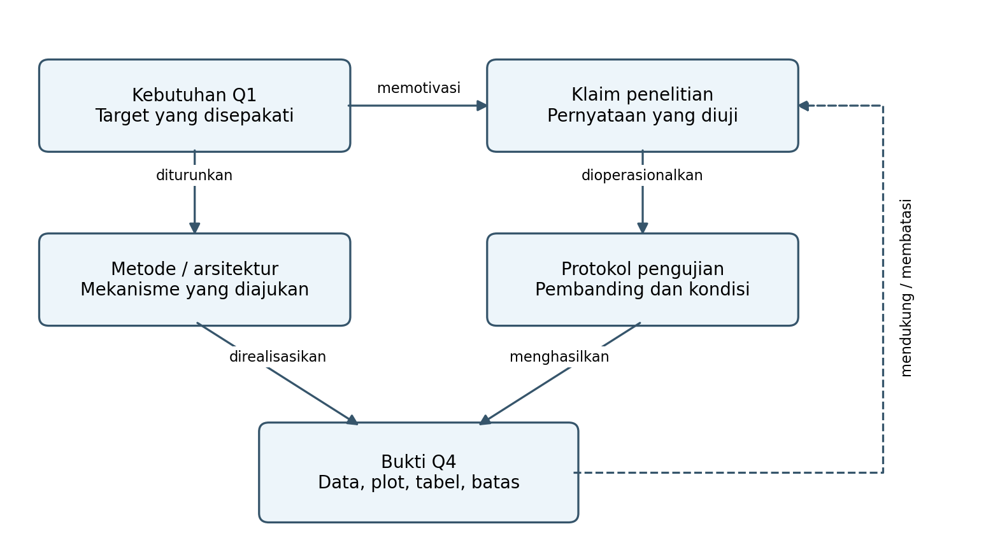
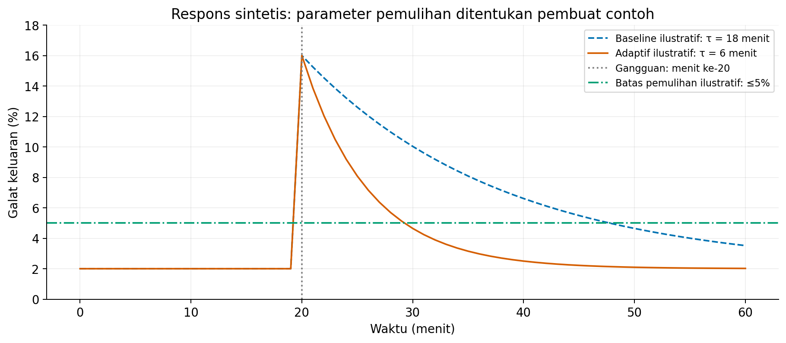
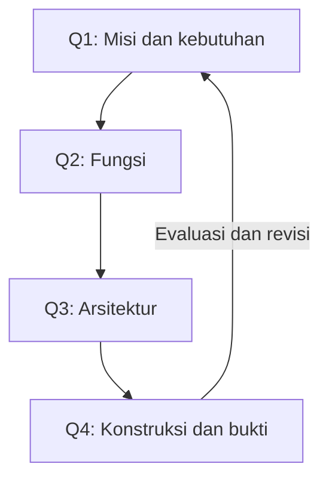
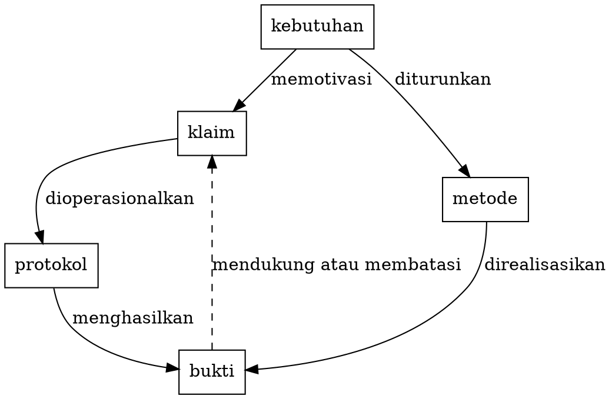

```{=typst}
#show table.cell: set par(justify: false)
```

# Pendahuluan

Tulisan akademik menyampaikan pengetahuan sekaligus memberi kesempatan kepada pembaca untuk memeriksanya. Pembaca perlu mengetahui masalah yang diselesaikan, alasan pemilihan metode, mekanisme yang diusulkan, kondisi pengujian, dan batas kesimpulan. Teks menjelaskan hubungan tersebut secara argumentatif, tetapi hubungan antarkomponen, variasi pengamatan, atau perbandingan banyak atribut sering lebih mudah diperiksa melalui representasi lain. Diagram, plot, gambar, dan tabel karena itu perlu dirancang bersama teks sejak penyusunan argumen.

Kepentingan visual memiliki dasar penelitian. Cleveland dan McGill menunjukkan melalui eksperimen bahwa cara mengodekan besaran memengaruhi ketepatan penilaian pembaca; posisi pada skala bersama dalam tugas yang mereka teliti lebih akurat dibandingkan beberapa pengodean panjang dan sudut [@cleveland1984]. Temuan tersebut memberi alasan untuk memilih bentuk visual berdasarkan tugas pembacaan, bukan sekadar kebiasaan perangkat lunak. Konteks eksperimen itu tidak membenarkan satu peringkat mutlak untuk semua jenis visual dan semua pembaca.

Weissgerber dan kolega, dalam telaah 703 artikel pada jurnal fisiologi, menunjukkan masalah penggunaan ringkasan untuk data kontinu: bentuk distribusi dan struktur berpasangan dapat tersembunyi oleh grafik rerata [@weissgerber2015]. Ruang lingkup penelitian tersebut perlu dipertahankan; persentase praktik pada jurnal fisiologi tidak otomatis mewakili seluruh publikasi akademik. Namun, masalah logisnya relevan secara luas: ringkasan yang benar secara numerik belum tentu cukup untuk menilai pola data.

Artikel ini membahas tiga pertanyaan:

- **PP1:** Informasi apa yang paling tepat disampaikan melalui teks, diagram, plot, gambar, atau tabel?
- **PP2:** Bagaimana bahasa dan aturan representasi dapat dihubungkan dengan TISE serta Q-Cycle?
- **PP3:** Bagaimana penulis menghasilkan representasi yang tertelusur dan dapat dibuat ulang?

Jawabannya berupa sintesis konseptual, matriks desain, dan demonstrasi, bukan estimasi empiris bahwa menambahkan gambar pasti meningkatkan mutu publikasi.

# Pendekatan dan batas kontribusi

Artikel menggunakan pembacaan terarah atas sumber primer terpilih mengenai persepsi grafis, desain figur, penyajian data, dan reproduksibilitas. Dokumentasi resmi dipakai untuk menjelaskan dukungan bahasa diagram dalam Quarto. Definisi TISE dan Q-Cycle bersumber pada naskah pengantar Langi, *Apa Itu TISE?*, bertanggal 23 Agustus 2026 [@langi2026tise]. Naskah tersebut diperlakukan sebagai sumber definisi kerangka penulis; artikel ini tidak menganggapnya sebagai bukti penelaahan sejawat atau efektivitas empiris.

Prosedur sintesis mencakup pemisahan fungsi representasi, pemetaan fungsi tersebut ke Q1–Q4, perumusan aturan ketertelusuran, dan demonstrasi dengan data buatan. Pemilihan sumber tidak memakai protokol pencarian sistematis, penilaian risiko bias, atau meta-analisis. Karena itu, artikel merupakan **paper konseptual dan metodologis**, bukan *systematic literature review*.

| Unsur artikel | Cara memperoleh | Status epistemik | Batas penggunaan |
|:---|:---|:---|:---|
| Persepsi dan penyajian data | Literatur primer terpilih | Temuan dari penelitian yang dirujuk | Pertahankan konteks setiap studi |
| TISE dan Q-Cycle | Naskah pengantar penulis | Definisi kerangka | Tidak dianggap sebagai teori yang telah tervalidasi universal |
| Matriks pemilihan representasi | Sintesis dalam artikel ini | Usulan konseptual | Perlu penyesuaian disiplin dan pengujian pengguna |
| Plot dan tabel numerik | Data sintetis yang dibangun secara eksplisit | Demonstrasi logika penyajian | Tidak membuktikan kinerja sistem nyata |
| Paket Quarto | Sumber teks, data, dan kode | Artefak yang dapat dibuat ulang | Reproduksibilitas tidak menjamin validitas model |

: Sumber, metode, dan batas klaim artikel. {#tbl-status}

Kontribusi yang diajukan ialah penempatan representasi sebagai bagian dari rantai masalah–fungsi–arsitektur–bukti. Nilai kontribusi ini terletak pada keteraturan argumentasi dan kemungkinan audit. Klaim tentang peningkatan kecepatan atau ketepatan pembaca tetap menjadi agenda pengujian mendatang sebagaimana dibahas pada bagian diskusi.

# Representasi komplementer dalam argumen ilmiah

## Fungsi teks, diagram, plot, gambar, dan tabel

Setiap bentuk penyajian memberi akses pada jenis informasi yang berbeda. Diagram menampilkan relasi; plot menampilkan besaran melalui posisi atau bentuk; foto menampilkan kondisi teramati; tabel mengorganisasi rincian menurut atribut. Istilah **visual** dalam artikel ini mencakup diagram, plot, dan gambar. Tabel dibahas tersendiri agar struktur baris–kolom dan ketepatan nilainya mendapat perhatian, meskipun secara perseptual tabel juga merupakan objek visual.

{#fig-representasi fig-alt="Pertanyaan dan klaim dihubungkan dengan teks, diagram, plot, tabel, dan gambar sebagai bentuk penyajian yang saling melengkapi."}

@fig-representasi menunjukkan bahwa satu pertanyaan dapat membutuhkan beberapa bentuk penyajian. Penjelasan mekanisme dapat memakai diagram, sementara evaluasinya membutuhkan plot dan tabel. Pengulangan angka di semua bentuk belum tentu bermanfaat; penulis perlu memberi tugas yang berbeda kepada setiap representasi. Ringkasan numerik di tabel dapat melengkapi pola yang terlihat pada plot tanpa menyalin seluruh data ke teks.

| Pertanyaan pembaca | Representasi yang diutamakan | Informasi yang harus ada | Yang belum dibuktikan oleh bentuk itu |
|:---|:---|:---|:---|
| Mengapa penelitian diperlukan? | Teks dan tabel kesenjangan | Konteks, sumber, kebutuhan, batas | Kebaruan tidak cukup dibuktikan oleh tabel fitur |
| Bagaimana mekanisme bekerja? | Diagram fungsi atau keadaan | Input, output, relasi, kondisi transisi | Panah belum membuktikan kausalitas |
| Siapa atau apa melaksanakan fungsi? | Diagram arsitektur dan matriks alokasi | Komponen, peran, antarmuka, kewenangan | Arsitektur belum membuktikan implementasi |
| Bagaimana pola hasilnya? | Plot yang sesuai desain studi | Sumbu, unit, pengamatan, variasi | Pola bersama belum membuktikan sebab-akibat |
| Berapa nilai tepatnya? | Tabel hasil | Ukuran, unit, sampel, pembanding | Angka ringkas belum memperlihatkan distribusi |
| Bagaimana wujud eksperimen? | Foto atau gambar dokumentasi | Identitas objek, skala, kondisi pengambilan | Foto alat belum membuktikan akurasi alat |

: Pemilihan bentuk berdasarkan pertanyaan pembaca. {#tbl-pemilihan}

Tabel unggul ketika pembaca perlu mencari nilai atau membandingkan atribut secara tepat. Plot unggul ketika bentuk distribusi atau perubahan menjadi inti pertanyaan. Tidak ada aturan bahwa plot selalu lebih baik daripada tabel. Pilihan bergantung pada tugas pembacaan: menemukan nilai tertentu berbeda dari mengenali pola nonlinier.

## Empat lapisan bahasa representasi

Bahasa visual dapat dianalisis melalui kosakata, sintaks, semantik, dan konteks penggunaan. Analogi dengan bahasa verbal ini bersifat operasional; tidak berarti semua foto memiliki grammar formal seperti bahasa pemrograman. Konvensi visual sebagian eksplisit, sebagian dipelajari dalam komunitas disiplin tertentu.

| Lapisan | Dalam diagram | Dalam plot | Dalam tabel |
|:---|:---|:---|:---|
| Kosakata | Kotak, panah, simbol, batas | Titik, garis, pita, sumbu | Baris, kolom, sel, catatan |
| Sintaks / grammar | Aturan sambungan dan arah | Pemetaan variabel ke posisi atau warna | Objek pada baris, atribut pada kolom |
| Semantik | Aliran data, urutan, kendali | Besaran, variasi, estimasi | Arti nilai pada perpotongan objek–atribut |
| Konteks | Mekanisme untuk pembaca bidang tertentu | Membandingkan atau mengevaluasi hasil | Menelusuri spesifikasi atau nilai tepat |

: Kosakata dan aturan representasi. Makna tidak boleh hanya bergantung pada warna. {#tbl-bahasa}

Kesalahan pada lapisan berbeda menghasilkan masalah berbeda. Salah arah panah adalah kesalahan relasi; skala logaritmik yang tidak dijelaskan adalah kesalahan interpretasi; angka dari kondisi pengujian berbeda yang disandingkan sebagai pembanding langsung adalah kesalahan validitas perbandingan. Perangkat lunak dapat menerima sintaks tersebut tanpa memahami apakah maknanya sah.

## Bahasa pembentuk visual

Bahasa untuk menghasilkan visual berbeda dari bahasa visual yang dibaca manusia. Mermaid mendeskripsikan diagram dengan sintaks teks; Graphviz memakai DOT untuk mendeskripsikan graf; Matplotlib merupakan pustaka Python untuk membuat figur melalui program. Quarto mendukung diagram Mermaid dan Graphviz di dalam dokumen [@mermaid2026; @graphviz2026; @quarto2026].

| Perangkat | Masukan utama | Tingkat pengaturan | Cocok untuk | Pemeriksaan ilmiah tetap diperlukan |
|:---|:---|:---|:---|:---|
| Mermaid | Entitas, relasi, urutan | Struktur diagram dan gaya | Alur proses, keadaan, urutan interaksi | Arti panah dan kelengkapan kondisi |
| Graphviz / DOT | Simpul, sisi, atribut | Graf dan kendali tata letak | Dependensi, arsitektur, jaringan | Batas sistem dan tipe hubungan |
| Matplotlib / Python | Data dan instruksi plot | Sumbu, markah, panel, anotasi | Grafik statistik dan figur ilmiah | Satuan, estimasi, skala, ketidakpastian |
| Markdown / Quarto | Isi sel dan struktur dokumen | Tabel, caption, rujukan silang | Matriks kebutuhan dan hasil | Kesetaraan kondisi dan arti setiap kolom |

: Perangkat pembentuk representasi dan tanggung jawab penulis. {#tbl-perangkat}

Kode yang dapat dibuat ulang mengurangi kebutuhan menyunting figur secara manual setiap kali data berubah. Namun, kemampuan menggambar ulang bukan jaminan kebenaran: program dapat secara konsisten menghasilkan visual dari data yang keliru. Audit harus mencakup sumber data, transformasi, dan interpretasi, bukan hanya file gambar akhir.

# TISE sebagai landasan sosio-teknis

## Definisi dan tiga sumber kecerdasan

TISE adalah **Triune-Intelligence Smart Engineering**, pendekatan untuk merekayasa ekosistem sosio-teknis berorientasi misi. Manusia dan organisasi yang otonom bekerja bersama teknologi, sumber daya, dan aturan untuk menghasilkan manfaat publik secara berkelanjutan. Tiga sumber kecerdasan—manusia atau alamiah, kolektif atau kultural, serta artifisial—memiliki fungsi yang saling melengkapi [@langi2026tise, bagian 1–3].

{#fig-triune fig-alt="Kecerdasan manusia, kolektif, dan AI memberi masukan bagi keputusan bersama yang menghasilkan tindakan ekosistem dan umpan balik."}

Dalam penulisan akademik, peran manusia mencakup menentukan pertanyaan, menilai bukti, dan mempertanggungjawabkan kesimpulan. Peran kolektif mencakup konvensi disiplin, kritik sejawat, negosiasi makna, dan pemeriksaan lintas keahlian. AI dapat membantu menyusun kode, menemukan inkonsistensi, atau mengusulkan representasi. Pemetaan tersebut merupakan **penerapan konseptual dalam artikel ini**, bukan pernyataan bahwa semua praktik publikasi sudah menjalankan TISE.

| Sumber kecerdasan | Fungsi dalam TISE | Penerapan pada tulisan akademik | Pemeriksaan yang diperlukan |
|:---|:---|:---|:---|
| Manusia / alamiah | Tujuan, pertimbangan, tanggung jawab | Merumuskan klaim dan menilai makna visual | Apakah interpretasi sesuai bukti? |
| Kolektif / kultural | Pengetahuan tersebar, norma, legitimasi | Menentukan istilah dan mengkritik argumen | Apakah pembaca lain memahami relasinya? |
| Artifisial | Analitik, prediksi, simulasi, rekomendasi | Membantu kode, tata letak, dan pemeriksaan | Apakah data, referensi, dan kode telah diverifikasi? |

: Tiga kecerdasan dan implikasinya bagi produksi naskah. Kolom penerapan merupakan usulan artikel. {#tbl-triune}

@fig-triune dan @tbl-triune menggunakan tingkat detail berbeda. Diagram memperlihatkan hubungan keputusan; tabel menjelaskan tanggung jawab. Menggabungkan keduanya membantu mencegah pembacaan bahwa kecerdasan artifisial merupakan otoritas tertinggi hanya karena menghasilkan visual yang tampak meyakinkan.

## Misi, pertukaran, dan batas kelayakan

Pengantar TISE memetakan sumber daya, misi, keluaran, dan nilai sebagai **RMOV** (*Resource–Mission–Output–Value*). Peran ekosistem mencakup **USER**, **SOURCE**, **OPERATOR**, dan **REGULATOR/GOVERNOR**. Pertukaran mencakup **PSKVE**: produk, layanan, pengetahuan, nilai atau komitmen, serta lingkungan. Keberlanjutan membatasi ruang tindakan yang layak sebelum optimasi dilakukan [@langi2026tise, bagian 4].

Dalam konteks tulisan, penulis menyediakan pengetahuan dan bukti, pembaca memakai hasilnya, proses editorial mengoordinasikan penyajian dan evaluasi, dan tata kelola akademik menjaga integritas. Satu pihak dapat menjalankan beberapa peran. Analogi tersebut membantu mengajukan pertanyaan: siapa yang memerlukan tabel ini, keputusan apa yang dibantu diagram ini, dan siapa yang memverifikasi asal datanya?

| Konsep TISE | Implikasi bagi representasi akademik | Artefak yang dapat memperjelasnya |
|:---|:---|:---|
| RMOV | Bedakan sumber, proses, hasil, dan manfaat | Diagram transformasi dan tabel indikator |
| USER–SOURCE–OPERATOR–REGULATOR | Tunjukkan pemakai, penyedia, pelaksana, pengawas | Diagram peran dan matriks tanggung jawab |
| PSKVE | Laporkan pertukaran dan dampak lintas dimensi | Tabel manfaat, biaya, pengetahuan, lingkungan |
| Keberlanjutan | Keunggulan lokal belum cukup untuk kelayakan ekosistem | Plot perubahan dan tabel batas penerimaan |
| Multi-Agentic Digital Twin | Jadikan asumsi agen dan skenario dapat diperiksa | Diagram agen, tabel parameter, plot skenario |

: Konsep TISE sebagai pertanyaan desain representasi. {#tbl-tise}

**Multi-Agentic Digital Twin** dalam pengantar TISE berfungsi sebagai laboratorium keputusan yang merepresentasikan agen dengan misi, kapasitas, aturan, dan batas. Hasil simulasi tetap bergantung pada asumsi serta kecocokan model terhadap dunia nyata. Karena itu, tabel parameter dan validasi model perlu menyertai plot simulasi; kurva yang halus tidak membuktikan model yang akurat.

## Q-Cycle dan PUDAL memiliki fungsi berbeda

TISE memakai **Q-Cycle** untuk merumuskan, merancang, membangun, dan merancang ulang ekosistem. **PUDAL**—*Perceive, Understand, Decide, Act, Learn*—mengatur adaptasi operasi dan pembelajaran dari hasil. PUDAL menangani penyesuaian di dalam arsitektur yang masih layak; Q-Cycle menangani kebutuhan perubahan fungsi, arsitektur, atau rumusan misi [@langi2026tise, bagian 5].

{#fig-arsitektur fig-alt="SOURCE memasok OPERATOR yang melayani USER. REGULATOR memberi batas, sedangkan kendali PUDAL menerima telemetri dan memberikan aksi yang disetujui."}

@fig-arsitektur menunjukkan pentingnya grammar: relasi pasokan, telemetri, dan kewenangan bukan hubungan yang identik. Membedakan label dan gaya garis membantu pembaca mengetahui apakah sistem mengirim data, mengubah tindakan, atau menetapkan batas. Panah aksi disetujui tidak menyiratkan bahwa rekomendasi AI otomatis menjadi perintah.

# Q-Cycle dan kebutuhan representasi

## Empat ruang pertanyaan

- **Q1** menanyakan perubahan yang dibutuhkan, untuk siapa, dan di bawah batas apa.
- **Q2** menguraikan fungsi serta perilaku yang harus menghasilkan perubahan.
- **Q3** mengalokasikan fungsi kepada komponen, pelaku, antarmuka, dan kendali.
- **Q4** membangun dan mengevaluasi realisasinya.

Bukti Q4 kembali kepada Q1 untuk menilai apakah kebutuhan awal terjawab atau perlu dirumuskan ulang.

{#fig-qcycle fig-alt="Q1 kebutuhan menuju Q2 fungsi, Q3 arsitektur, Q4 konstruksi dan bukti, kemudian kembali melalui evaluasi ke Q1."}

Warna pada @fig-qcycle merupakan pilihan presentasi: biru pucat untuk Q1, cokelat pucat untuk Q2, kuning untuk Q3, dan putih keabu-abuan untuk Q4. Istilah *black box* pada Q1 menyatakan tingkat abstraksi, sehingga tidak bergantung pada warna isi kotak. Pembaca yang melihat versi monokrom tetap dapat mengikuti label dan arah.

| Ruang | Pertanyaan pokok | Isi yang perlu dilaporkan | Representasi yang membantu | Lompatan argumen yang dicegah |
|:---|:---|:---|:---|:---|
| Q1 | Perubahan apa yang diperlukan? | Kebutuhan, kesenjangan, target, pemangku kepentingan | Tabel masalah–target; diagram konteks | Memilih teknologi sebelum masalah jelas |
| Q2 | Fungsi apa menghasilkan perubahan? | Input, output, aliran, keadaan, ukuran kinerja | Diagram fungsi; tabel persyaratan | Menganggap daftar fitur sebagai mekanisme |
| Q3 | Bagaimana fungsi dialokasikan? | Komponen, antarmuka, peran, kontrol | Diagram arsitektur; matriks alokasi | Komponen tanpa alasan fungsional |
| Q4 | Bagaimana realisasi dibuktikan? | Implementasi, protokol, data, pembanding, batas | Foto, plot, tabel hasil dan audit | Menganggap prototipe berjalan sebagai validasi misi |

: Kebutuhan representasi pada Q1–Q4. {#tbl-qcycle}

Urutan empat ruang tidak harus identik dengan urutan bab. Artikel pendek dapat menggabungkan Q2 dan Q3 dalam metode, sedangkan disertasi dapat menguraikannya dalam beberapa bab. Yang harus dijaga adalah ketertelusuran, bukan kepatuhan pada satu susunan judul.

## Kedalaman kontribusi dan fungsi visual

Dalam penelitian rekayasa, letak kontribusi perlu dinyatakan. Kontribusi dapat berupa konstruksi baru, arsitektur yang lebih baik, mekanisme fungsional baru, atau rumusan masalah yang mengubah cara melihat kebutuhan. Sebagai heuristik pembimbingan, kedalaman konseptual umumnya meningkat dari tugas akhir menuju tesis dan disertasi. Heuristik tersebut tidak menggantikan ketentuan program studi dan tidak menyatakan bahwa setiap disertasi wajib baru pada semua Q.

| Tingkat karya | Fokus kontribusi yang dapat diperiksa | Visual atau tabel yang sangat membantu | Pertanyaan audit |
|:---|:---|:---|:---|
| Tugas akhir | Konstruksi yang tepat, berfungsi, dan diuji | Arsitektur, dokumentasi prototipe, tabel uji | Apakah hasil menjawab kebutuhan terbatas? |
| Tesis | Perbaikan metode atau arsitektur dengan pembanding | Diagram alternatif, plot komparatif, tabel ablation | Apa yang berubah dan mengapa lebih baik? |
| Disertasi | Kemajuan pengetahuan konseptual atau metodologis dengan bukti memadai | Model mekanisme, arsitektur, bukti lintas kondisi | Pengetahuan baru apa yang berlaku, di bawah batas apa? |

: Heuristik kedalaman kontribusi, bukan persyaratan institusional universal. {#tbl-jenjang}

Kebaruan diagram tidak sama dengan kebaruan penelitian. Menggambar ulang arsitektur lama dengan bentuk yang menarik tidak menghasilkan mekanisme baru. Sebaliknya, mekanisme baru yang dijelaskan melalui diagram sederhana dapat menjadi kontribusi kuat bila argumentasi, pembanding, dan bukti mendukungnya.

## Matriks ketertelusuran

Tabel ketertelusuran menghubungkan kebutuhan dengan fungsi, realisasi, dan pengujian. Dalam contoh layanan kampus pada @tbl-trace, target merupakan **spesifikasi ilustratif**, bukan standar yang berasal dari pengukuran lapangan. Setiap kebutuhan memiliki identitas sehingga hubungan dapat dilacak ketika implementasi atau prosedur uji berubah.

| ID / kebutuhan Q1 | Fungsi Q2 | Elemen Q3 | Bukti yang diperlukan pada Q4 | Kriteria ilustratif |
|:---|:---|:---|:---|:---|
| K1: waktu tunggu terkendali | Mengestimasi permintaan dan mengalokasikan kapasitas | Estimator, penjadwal, petugas layanan | Log waktu tunggu dan distribusi per periode | Persentil ke-95 ≤15 menit |
| K2: operasi pulih setelah gangguan | Mendeteksi deviasi dan menyesuaikan tindakan | Monitor, PUDAL, persetujuan operator | Kurva pemulihan dan log tindakan | Galat ≤5% dalam ≤15 menit |
| K3: usaha penyedia tetap layak | Memeriksa biaya dan batas kapasitas | Modul biaya, penyedia, kebijakan subsidi | Tabel pendapatan, biaya, serta skenario | Margin tidak negatif selama skenario uji |
| K4: manusia tetap mampu menilai | Menjelaskan rekomendasi dan menerima koreksi | Antarmuka alasan dan override | Uji pemahaman dan catatan koreksi | Target ditetapkan sebelum uji pengguna |

: Ketertelusuran contoh layanan kampus. Seluruh target bersifat ilustratif dan memerlukan kesepakatan pemangku kepentingan. {#tbl-trace}

Tabel ini lebih kuat daripada daftar fitur karena memperlihatkan pekerjaan validasi yang belum selesai. Kolom “bukti yang diperlukan” menyatakan rencana pengujian, bukan bukti yang sudah tersedia. Ketika suatu fungsi tidak memiliki kebutuhan asal atau suatu kebutuhan tidak memiliki pengujian, ketidakterhubungan tersebut dapat diperiksa secara langsung.

{#fig-bukti fig-alt="Kebutuhan memotivasi klaim dan metode. Klaim dioperasionalkan dalam protokol; metode serta protokol menghasilkan bukti yang kemudian mendukung atau membatasi klaim."}

@fig-bukti menunjukkan bahwa klaim perlu dioperasionalkan sebelum dinilai. Pernyataan “lebih adaptif” memerlukan definisi gangguan, ukuran pemulihan, baseline, dan batas penerimaan. Plot respons tanpa unsur tersebut baru memperlihatkan kurva; ia belum memberi dasar yang cukup untuk menyatakan keberhasilan penelitian.

# Demonstrasi: tabel dan plot sebagai pasangan bukti

## Ringkasan sama, pola berbeda

Demonstrasi pertama membangun dua kelompok berisi delapan nilai. Vektor awal A adalah $(-3,-2,-1,-0{,}5,0{,}5,1,2,3)$; vektor awal B berisi empat nilai $-1$ dan empat nilai $1$. Keduanya ditransformasikan dengan $x_i=50+10(u_i-\bar{u})/s_u$, dengan $s_u$ simpangan baku sampel. Dengan demikian, rerata dan simpangan baku sampel keduanya sama menurut konstruksi.

| Kelompok sintetis | Jumlah nilai | Rerata | SD sampel | Struktur nilai |
|:---|:---|:---|:---|:---|
| A | 8 | 50,00 | 10,00 | Delapan nilai berbeda yang menyebar |
| B | 8 | 50,00 | 10,00 | Dua nilai berbeda, masing-masing berulang empat kali |

: Ringkasan tepat dari data sintetis. SD adalah simpangan baku sampel, bukan standard error atau interval kepercayaan. {#tbl-distribusi}

{#fig-distribusi fig-alt="Dua batang rerata dan SD identik, tetapi titik individual mengungkap delapan nilai berbeda pada kelompok A dan dua kumpulan nilai berulang pada kelompok B."}

@tbl-distribusi menjawab berapa rerata, SD, dan jumlah pengamatan. @fig-distribusi menjawab bagaimana pola nilai. Tabel ringkasan tidak salah; informasi yang dibawanya berbeda dari titik individual. Contoh ini mengilustrasikan kebutuhan menyesuaikan bentuk penyajian dengan pertanyaan, sejalan dengan perhatian terhadap keterbukaan distribusi dalam literatur [@weissgerber2015]. Ia tidak membuktikan bentuk distribusi populasi karena tidak ada pengambilan sampel populasi.

## Perubahan berpasangan dan heterogenitas

Demonstrasi kedua menggunakan dua belas pasangan waktu layanan buatan. Setiap baris CSV adalah kasus yang sama sebelum dan sesudah intervensi hipotetis. Selisih didefinisikan $d_i=y_{i,\mathrm{sesudah}}-y_{i,\mathrm{sebelum}}$, sehingga nilai negatif berarti waktu berkurang. Tabel melaporkan ringkasan, sedangkan plot mempertahankan pasangan individual.

| Ukuran deskriptif | Nilai | Makna |
|:---|:---|:---|
| Jumlah pasangan | 12 | Dua belas kasus sintetis yang sama |
| Rerata sebelum | 12,00 menit | Rerata waktu awal |
| Rerata sesudah | 9,92 menit | Rerata waktu sesudah |
| Rerata selisih | −2,08 menit | Rerata sesudah dikurangi sebelum |
| SD sampel selisih | 1,24 menit | Variasi selisih antarkasus |
| Kasus dengan waktu berkurang | 11 dari 12 | Perubahan ke arah yang diinginkan |
| Kasus dengan waktu meningkat | 1 dari 12 | Hasil tidak seragam |

: Ringkasan pasangan sintetis, dibulatkan menjadi dua desimal. Tidak ada pengujian hipotesis atau klaim populasi. {#tbl-paired}

{#fig-paired fig-alt="Sebelas garis waktu layanan menurun dan satu meningkat. Plot selisih memperlihatkan satu kasus positif di atas nol walaupun rerata perubahan negatif."}

@fig-paired memperlihatkan satu kasus yang memburuk meskipun rerata membaik. Pada penelitian nyata, informasi tersebut dapat memotivasi analisis kondisi kegagalan, namun penyebabnya tidak dapat ditentukan dari plot ini saja. Data tambahan tentang konteks kasus diperlukan. Garis penghubung juga mengomunikasikan desain berpasangan; dua batang rerata terpisah tidak membawa informasi desain yang sama.

Artikel tidak menghitung *p-value* dari data ini karena nilai telah dibuat untuk tujuan demonstrasi. Dalam penelitian nyata, inferensi memerlukan penjelasan unit analisis, ketergantungan pengamatan, prosedur sampling, ukuran efek, dan ketidakpastian yang sesuai. Menampilkan pita atau error bar tanpa definisi tidak memenuhi kebutuhan tersebut.

## Respons dinamis dan target Q1

Demonstrasi ketiga memperlihatkan respons galat setelah gangguan hipotetis pada menit ke-20. Untuk $t<20$, galat ditetapkan 2%. Untuk $t\geq20$, galat ditetapkan melalui persamaan berikut:

$$
e(t)=2+14\exp\left[-\frac{t-20}{\tau}\right].
$$

Satuan $e$ adalah persen dan satuan $t$ serta $\tau$ adalah menit. Parameter baseline dipilih $\tau=18$, sedangkan parameter adaptif dipilih $\tau=6$. Batas pemulihan ilustratif adalah $e(t)\leq5\%$ setelah gangguan. Waktu pemulihan diskret dicari pada pengamatan setiap satu menit, bukan dibaca secara bebas dari ketebalan garis.

{#fig-pemulihan fig-alt="Kurva baseline dan adaptif melonjak ke galat 16 persen pada menit ke-20, lalu meluruh dengan konstanta waktu berbeda. Kurva adaptif lebih cepat melintasi batas galat 5 persen."}

| Model ilustratif | Konstanta waktu | Menit pertama memenuhi batas setelah gangguan | Durasi pemulihan | Target durasi ≤15 menit |
|:---|:---|:---|:---|:---|
| Baseline | 18 menit | Menit ke-48 | 28 menit | Tidak terpenuhi dalam contoh |
| Adaptif | 6 menit | Menit ke-30 | 10 menit | Terpenuhi dalam contoh |

: Hasil perhitungan model sintetis pada grid satu menit. Keunggulan kurva ditentukan oleh parameter yang dipilih, bukan ditemukan melalui eksperimen. {#tbl-pemulihan}

@fig-pemulihan menjelaskan bentuk respons, sedangkan @tbl-pemulihan memberi nilai tepat dan status terhadap target. Secara analitis, titik lintas batas setelah gangguan adalah $t=20+\tau\ln(14/3)$; pembulatan ke menit pengamatan berikutnya menghasilkan angka dalam tabel. Ini memperlihatkan kesesuaian data, persamaan, plot, dan kriteria, tetapi tidak menunjukkan bahwa suatu sistem nyata mempunyai parameter tersebut.

Dalam riset TISE, penilaian tidak berhenti pada pemulihan cepat. Tindakan yang mempercepat layanan sambil membuat penyedia merugi atau melemahkan kemampuan operator dapat melanggar batas kelayakan ekosistem. Oleh sebab itu, kebutuhan K2 pada @tbl-trace harus dinilai bersama K3 dan K4. Plot satu indikator sebaiknya tidak dijadikan pengganti evaluasi lintas pemangku kepentingan.

# Prinsip desain dan audit representasi

## Kejelasan, kejujuran, dan aksesibilitas

Rougier dan kolega menekankan penentuan pembaca serta pesan, penyesuaian terhadap medium, penggunaan caption, dan penghindaran penyajian yang menyesatkan [@rougier2014]. Artikel ini menerjemahkan perhatian tersebut menjadi pertanyaan audit pada @tbl-audit. Pertanyaan ini merupakan sintesis praktis, bukan instrumen psikometrik yang telah divalidasi.

| Dimensi | Pertanyaan audit | Tindakan perbaikan konkret |
|:---|:---|:---|
| Relevansi | Klaim mana dibantu representasi ini? | Tulis satu kalimat fungsi; hapus representasi tanpa tugas |
| Kosakata | Apakah simbol dan istilah terdefinisi? | Tambahkan label atau legenda singkat |
| Relasi | Apakah arah dan jenis hubungan jelas? | Bedakan data, tindakan, kewenangan, dan urutan |
| Skala | Apakah unit dan transformasi dijelaskan? | Nyatakan skala linear/log; jelaskan pemotongan sumbu |
| Variasi | Apakah pola individual atau distribusi penting? | Sertakan titik, distribusi, atau pasangan bila relevan |
| Ketidakpastian | Apakah pita berarti SD, SE, atau CI? | Definisikan estimasi dan cara perhitungannya |
| Perbandingan | Apakah kondisi dan denominator sebanding? | Nyatakan ukuran sampel, perangkat, dan skenario |
| Keterbacaan | Apakah label terbaca pada ukuran publikasi? | Periksa ukuran akhir dan kontras |
| Aksesibilitas | Apakah makna tetap jelas tanpa warna? | Pakai label, bentuk, pola garis, dan teks alternatif |
| Provenans | Dapatkah nilai ditelusuri ke sumbernya? | Hubungkan data, skrip, versi, dan keluaran |

: Audit representasi sebagai usulan operasional artikel. {#tbl-audit}

Pemotongan sumbu tidak selalu salah, terutama ketika diperlukan untuk memeriksa perubahan kecil. Akan tetapi, penulis perlu menjelaskannya dan mempertimbangkan apakah bentuk pengodean mengundang pembaca menilai rasio yang tidak sah. Pada grafik batang yang memakai panjang sebagai besaran, titik nol umumnya diperlukan agar perbandingan panjang bermakna. Skala logaritmik juga sah jika cocok bagi data dan dinyatakan secara eksplisit.

Tabel perlu menjaga konsistensi pembulatan, unit, dan penyebut. “Akurasi 95%” belum cukup jika jumlah kasus, ketidakseimbangan kelas, atau unit evaluasi tidak jelas. Sel kosong tidak boleh diam-diam dibaca sebagai nol; penulis harus membedakan “tidak diukur”, “tidak tersedia”, dan nilai nol. Penebalan nilai terbaik dapat membantu pembacaan, tetapi tidak boleh menyembunyikan kompromi dengan biaya, keselamatan, atau variasi.

## Caption dan hubungan dengan teks

Caption perlu memuat objek, kondisi, definisi markah, dan catatan interpretasi yang diperlukan untuk membaca figur. Untuk plot eksperimen, informasi penting sering mencakup jumlah pengamatan, unit analisis, serta arti error bar. Untuk foto, informasi dapat mencakup konfigurasi, skala, dan proses pengolahan citra yang relevan. Caption tidak perlu mengulang seluruh metode, tetapi harus menunjuk pada bagian metode yang menjelaskannya.

Teks di sekitar representasi memiliki tugas interpretasi. Pola penulisan yang dapat dipakai adalah:

1. **Apa yang diperlihatkan**
2. **Apa artinya**
3. **Klaim mana yang didukung**
4. **Apa batasnya**

Pada demonstrasi pasangan, misalnya, rerata pengurangan waktu disertai satu kasus memburuk; kesimpulan deskriptifnya adalah adanya variasi perubahan, sedangkan kesimpulan kausal belum tersedia. Menulis “hasil terlihat pada Gambar X” saja belum menjelaskan implikasi ilmiahnya.

Foto prototipe memerlukan perhatian tersendiri. Penyuntingan pencahayaan untuk keterbacaan perlu dibedakan dari perubahan yang memengaruhi interpretasi bukti. Gambar buatan dapat membantu menjelaskan konsep, tetapi harus diberi label ilustrasi dan tidak disajikan sebagai dokumentasi eksperimen yang benar-benar dilakukan. Paket artikel ini memakai diagram serta plot komputasional dan tidak mengklaim memiliki foto pengujian lapangan.

# Implementasi melalui Quarto

## Satu sumber untuk teks, tabel, dan figur

Quarto memungkinkan naskah Markdown, metadata YAML, sitasi, tabel, dan rujukan silang berada dalam satu proyek. Dukungan diagram memudahkan penyimpanan struktur bersama dokumen [@quarto2026]. Dalam paket artikel ini, figur telah disertakan sebagai PNG untuk pemakaian lintas format dan sebagai SVG untuk penyuntingan atau ekspor vektor. Skrip Python membentuk kembali seluruh figur dan data sintetis.

| Berkas / direktori | Fungsi | Hubungan reproduksibilitas |
|:---|:---|:---|
| `paper.qmd` | Sumber utama artikel | Menampung klaim, caption, sitasi, dan rujukan silang |
| `_quarto.yml` | Konfigurasi HTML dan PDF | Mengatur bahasa, penomoran, dan tampilan |
| `references.bib` | Metadata rujukan | Menghubungkan sitasi ke sumber yang dinyatakan |
| `generate_figures.py` | Pembentuk diagram, plot, dan data | Menyatakan transformasi serta parameter |
| `data/` | CSV dan ringkasan numerik | Memungkinkan pemeriksaan nilai tepat |
| `figures/` | PNG dan SVG | Keluaran yang dipakai dalam naskah |
| `diagrams/` | Contoh Mermaid dan DOT | Menyimpan alternatif deskripsi struktur |
| `README.md` | Petunjuk dan batas validasi | Menjelaskan cara menjalankan serta status pemeriksaan |

: Struktur proyek dan fungsi setiap sumber. {#tbl-berkas}

Rujukan silang memakai identitas stabil seperti `fig-qcycle` dan `tbl-trace`. Identitas tersebut memisahkan hubungan logis dari nomor urut yang dapat berubah saat penyuntingan. Memindahkan figur kemudian tidak perlu diikuti penyuntingan manual setiap nomor gambar di seluruh naskah.

## Kode singkat pembentuk representasi

Contoh Mermaid berikut menjelaskan aliran fungsional dan umpan balik. Ia merupakan contoh bahasa dalam artikel; diagram utama tersedia sebagai figur statis agar paket tetap mudah dibaca tanpa menjalankan mesin diagram.



Contoh DOT menghubungkan kebutuhan dan klaim dengan metode serta bukti. Label hubungan perlu dipilih berdasarkan makna, bukan berdasarkan posisi kotak.



Contoh Matplotlib berikut membaca CSV demonstrasi kedua. Posisi vertikal menyatakan menit; penghubung mempertahankan identitas pasangan.

```python
import csv
import matplotlib.pyplot as plt

with open("data/berpasangan-sintetis.csv") as f:
    rows = list(csv.DictReader(f))

fig, ax = plt.subplots()
for row in rows:
    before = float(row["sebelum_menit"])
    after = float(row["sesudah_menit"])
    ax.plot([0, 1], [before, after], "-o", alpha=0.6)
ax.set_xticks([0, 1], ["Sebelum", "Sesudah"])
ax.set_ylabel("Waktu layanan (menit)")
fig.savefig("pasangan.svg", bbox_inches="tight")
```

Kode asli di `generate_figures.py` mencakup tata letak, panel tambahan, dan definisi seluruh angka pada naskah. Contoh di atas bertujuan menunjukkan hubungan bahasa kode dengan bahasa visual, bukan mengklaim bahwa satu cuplikan tersebut menghasilkan seluruh paket.

## Provenans dan pemeriksaan keluaran

Sandve dan kolega menekankan pelacakan prosedur, data, serta lingkungan komputasi sebagai bagian dari penelitian yang dapat dibuat ulang [@sandve2013]. Penerapannya pada representasi ialah menjaga hubungan data sumber dengan transformasi, tabel ringkasan, dan figur akhir. Simpan parameter model serta versi dependensi; periksa apakah pembulatan tabel konsisten dengan data tanpa membulatkan data sumber terlalu dini.

Pemeriksaan dilakukan pada tiga tingkat:

- **Struktural:** semua label, file, dan sitasi tersedia.
- **Numerik:** tabel, persamaan, dan plot mengacu pada nilai yang sama.
- **Visual:** teks tidak terpotong, relasi dapat dibaca, dan tampilan tetap jelas pada ukuran akhir.

Memeriksa kode tanpa melihat keluaran tidak cukup, karena tata letak yang sah dapat tetap sulit dibaca.

# Diskusi

## Representasi sebagai infrastruktur argumen

Sintesis artikel ini menghasilkan tiga proposisi:

- **P1:** Representasi memperkuat argumen ketika dipilih menurut pertanyaan pembaca.
- **P2:** Kombinasi diagram dan tabel ketertelusuran membuat hubungan Q1–Q4 lebih eksplisit dan lebih mudah diperiksa secara konseptual.
- **P3:** Kode serta data sumber membuka kemungkinan reproduksi representasi dan audit transformasi.

Ketiga proposisi belum diukur melalui eksperimen pembaca dalam artikel ini.

Peran TISE terletak pada penempatan komunikasi ilmiah dalam sistem tanggung jawab bersama. Manusia mempertanggungjawabkan klaim, kolektif mengkritik makna dan kelayakan, sementara AI dapat membantu produksi. Q-Cycle memberi jalur audit: apakah visual metode menjawab fungsi yang diturunkan dari masalah, dan apakah plot hasil menguji kriteria yang sebelumnya ditetapkan? Dengan jalur ini, pengadaan figur tidak menjadi keputusan tata letak belaka.

Ketertelusuran juga dapat mengungkap kegagalan. Jika tabel memperlihatkan kebutuhan yang belum mempunyai bukti, penulis tidak seharusnya menghapus baris tersebut agar naskah tampak lengkap. Ia perlu membatasi klaim atau melengkapi pengujian. Sebuah representasi bernilai ilmiah ketika membuat kelemahan terlihat dan dapat ditangani, bukan hanya ketika memperindah keberhasilan.

## Batas penerapan dan risiko kepadatan

Artikel ini memilih sumber secara terarah, sehingga tidak mencakup seluruh penelitian tentang komunikasi multimodal atau perbedaan budaya membaca visual. Kerangka Q-Cycle paling langsung berlaku pada penelitian rekayasa artefak. Adaptasi ke penelitian historis, etnografi, atau matematika murni memerlukan penyesuaian terhadap jenis pertanyaan dan bukti; struktur konstruksi prototipe tidak boleh dipaksakan pada semua disiplin.

Banyaknya representasi juga dapat membebani pembaca. Matriks yang sangat lebar, diagram dengan terlalu banyak koneksi, atau plot yang menumpuk banyak seri dapat menghalangi tugas audit. Materi inti sebaiknya menjawab klaim utama, sedangkan rincian penuh dapat ditempatkan dalam lampiran dan data pendukung. Kelengkapan berarti semua informasi yang relevan tersedia dan terhubung, bukan semua informasi harus berada pada satu halaman.

Reproduksi kode menghasilkan keluaran yang sama dari masukan yang sama. Hal itu berbeda dari replikasi hasil pada data independen dan berbeda lagi dari validasi hubungan sebab-akibat. Ketiga demonstrasi sintetis di artikel ini hanya membuktikan konsistensi konstruksi contoh, bukan bahwa model atau intervensi efektif di lingkungan nyata.

## Rancangan evaluasi empiris berikutnya

Usulan artikel dapat diuji melalui eksperimen pembaca dengan materi ilmiah yang sama dan bentuk penyajian berbeda. Kondisi teks saja dibandingkan dengan teks plus representasi yang relevan; versi representasi ambigu dapat digunakan untuk memeriksa peran label dan ketertelusuran. Panjang materi, informasi faktual, dan kesulitan tugas perlu dikendalikan agar efek tidak semata berasal dari tambahan isi.

| Komponen evaluasi | Rancangan yang diusulkan | Hasil yang dinilai |
|:---|:---|:---|
| Tugas mekanisme | Membaca aliran dan mengidentifikasi relasi | Ketepatan jawaban dan waktu penyelesaian |
| Tugas bukti | Menentukan apakah klaim didukung data | Ketepatan audit, termasuk deteksi klaim berlebihan |
| Tugas nilai | Mencari angka atau membandingkan kondisi | Ketepatan pengambilan nilai dan waktu |
| Tugas ketertelusuran | Menemukan kebutuhan tanpa fungsi atau pengujian | Jumlah ketidakterhubungan yang ditemukan |
| Pengendalian | Acak urutan dan seimbangkan versi materi | Mengurangi efek urutan serta keahlian awal |
| Analisis | Tetapkan ukuran primer; laporkan efek dan interval | Besaran manfaat beserta ketidakpastiannya |

: Agenda evaluasi empiris. Belum ada peserta atau hasil eksperimen yang dilaporkan. {#tbl-evaluasi}

Keahlian peserta perlu dicatat karena mahasiswa pemula dan peneliti berpengalaman dapat memakai strategi pembacaan berbeda. Jumlah peserta ditentukan melalui analisis daya atau presisi yang sesuai dengan ukuran hasil primer. Tugas berulang perlu dianalisis dengan memperhatikan ketergantungan pada peserta dan materi. Penilaian estetika dapat menjadi ukuran sekunder, namun tidak menggantikan ketepatan pemahaman atau audit klaim.

# Kesimpulan

Visual dan tabel penting karena menyediakan cara berbeda untuk memahami serta memeriksa argumen ilmiah. Diagram membuka struktur dan mekanisme, plot memperlihatkan pola serta variasi, gambar mendokumentasikan wujud dan kondisi, sedangkan tabel mempertahankan rincian serta hubungan atribut. Teks menghubungkan seluruhnya dengan alasan, interpretasi, dan batas kesimpulan.

TISE memberi konteks tanggung jawab manusia, kolektif, dan AI; Q-Cycle memberi struktur ketertelusuran dari masalah melalui fungsi serta arsitektur menuju bukti. Integrasi keduanya dalam artikel ini menghasilkan panduan konseptual untuk merancang representasi yang relevan dan dapat diaudit. Demonstrasi sintetis menunjukkan bahwa ringkasan numerik, struktur pasangan, serta asumsi dinamika perlu dibaca bersama, tetapi tidak merupakan validasi empiris kerangka.

Penulis akademik sebaiknya memulai dari pertanyaan dan klaim, menentukan informasi yang perlu diperiksa, memilih bentuk penyajian, lalu menguji konsistensi sumber, makna, angka, dan tampilan. Kualitas ilmiah representasi terletak pada kemampuan membuka argumen bagi pemeriksaan, termasuk ketika pemeriksaan tersebut mengungkap keterbatasan penelitian.

# Pernyataan data, kode, dan bantuan penulisan {.unnumbered}

Semua angka demonstrasi bersifat sintetis. CSV, ringkasan numerik, skrip pembentuk figur, dan sumber Quarto disertakan dalam paket. Dokumen TISE yang dirujuk merupakan naskah pengantar pribadi penulis dan tidak didistribusikan ulang dalam paket ini. Draf disusun dengan bantuan AI untuk pengorganisasian, penulisan, kode, dan pemeriksaan; atribusi penulis, substansi, serta pengungkapan bantuan harus ditinjau sebelum pengajuan ke penerbit.

# Daftar pustaka {.unnumbered}

::: {#refs}
:::
